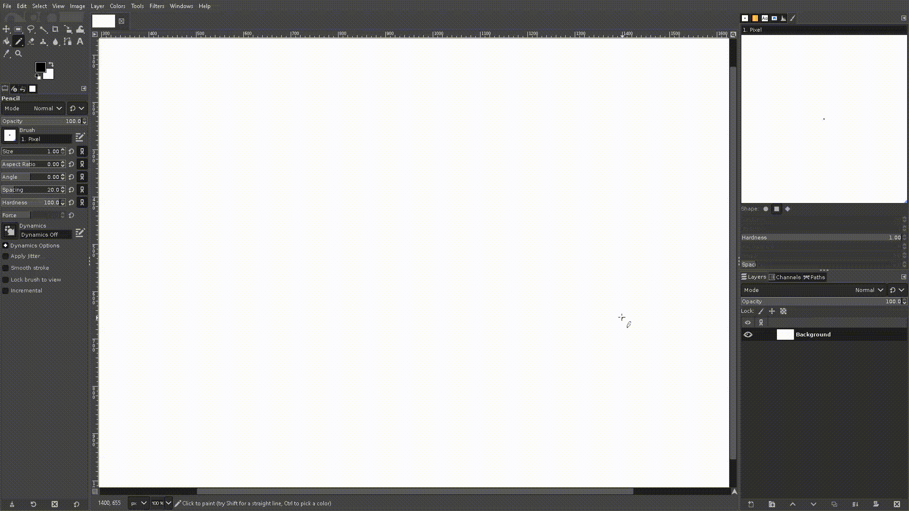

# nn-mouse

Neural network based humanized mouse movements. The models in this projects are from https://github.com/DaiCapra/Natural-Mouse-Movements-Neural-Networks

## Demo



## Installation

You can install the package via pip:

```
pip install nn-mouse mouse
```

Note: Any mouse module that can parse the current location of the mouse and move the mouse can be used. In this example, https://github.com/boppreh/mouse is used.

## Usage

```python
import time

import mouse

from nn_mouse import get_path

# monitor size
w, h = 1920, 1080

# current location
x, y = mouse.get_position()

# destination location
x1, y1 = 435, 578

# get the path of the movement
path = get_path(x, y, x1, y1, w, h)
# [
#     (614.0211354717612, 247.95467158179963, 7.2918200492858884e-06),
#     (605.374471783638, 262.2269676923752, 0.0002616463661193848),
#     (605.2463676929474, 262.5907788351178, 0.00032121673583984374),
#     (605.0176306962967, 263.15670113265514, 0.00036980979919433595),
#     (604.8388337492943, 264.25625159591436, 0.0004095515823364258),
#     ...
# ]

# move the mouse based on the path
for x, y, t in path:
    mouse.move(x, y)
    time.sleep(t)

```

## License

This project is licensed under the terms of the MIT license.
